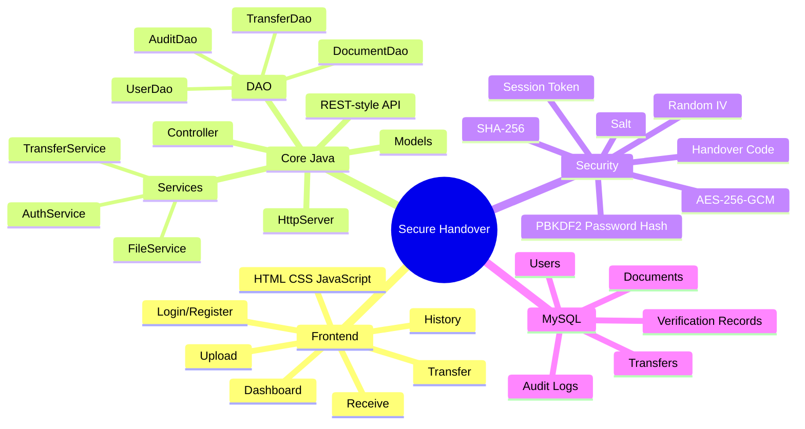

# Secure Handover — Mind Map

```mermaid
mindmap
 root((Secure Handover))
  Frontend
   Login/Register
   Dashboard
   Upload
   Transfer
   Receive
   History
   HTML CSS JavaScript
  Core Java
   HttpServer
   REST-style API
   Controller
   Services
    AuthService
    FileService
    TransferService
   DAO
    UserDao
    DocumentDao
    TransferDao
    AuditDao
   Models
  Security
   PBKDF2 Password Hash
   Salt
   AES-256-GCM
   Random IV
   Handover Code
   SHA-256
   Session Token
  MySQL
   Users
   Documents
   Transfers
   Audit Logs
   Verification Records
```
